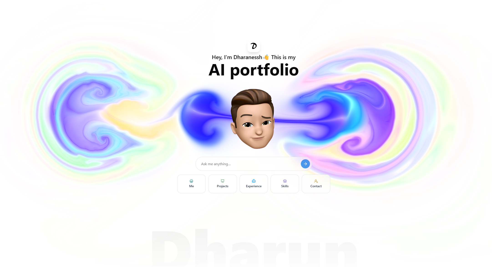

# Dharanessh's Interactive AI Portfolio 🤖✨

<p align="center">
  <a href="https://dharun-ai-portfolio.vercel.app/"><strong>Try the Live Demo</strong></a>
</p>

**Static portfolios are a thing of the past.** Instead of a page you just scroll, this is a conversation you can have.

Ask my AI avatar—a digital version of me, trained on my skills, projects, and experience—anything you want to know. It's built to give you instant, tailored answers.

## 👇 What can you ask?

- 🧠 **For Recruiters:** "What's your experience with Python and Spring Boot?" or "Tell me about your projects."
- 💻 **For Developers:** "What's the tech stack for this portfolio?" or "What are you passionate about?"
- 🧑‍🤝‍🧑 **For Anyone:** "What do you do for fun?" or "How can I contact you?"

---

## 🛠️ Tech Stack

This project was built using a modern, full-stack approach:

- **Framework:** [Next.js](https://nextjs.org/)
- **UI:** [React](https://react.dev/), [TypeScript](https://www.typescriptlang.org/), [Tailwind CSS](https://tailwindcss.com/), [Shadcn/ui](https://ui.shadcn.com/), [Framer Motion](https://www.framer.com/motion/)
- **AI & Backend:** [Vercel AI SDK](https://sdk.vercel.ai/), [Next.js API Routes](https://nextjs.org/docs/api-routes/introduction), [OpenAI GPT-4o-mini](https://openai.com/gpt-4o/)

The AI uses a tool-calling mechanism to dynamically pull specific information like my resume, projects, or contact details.

## 🚀 Running Locally

Want to see how it works under the hood?

1.  **Clone the repository:**
    ```bash
    git clone https://github.com/DharanesshMD/Dharanessh-AI-Portfolio.git
    cd Dharanessh-AI-Portfolio
    ```

2.  **Install dependencies:**
    ```bash
    npm install
    ```

3.  **Set up environment variables:**
    Create a `.env.local` file in the root and add your OpenAI API key:
    ```env
    OPENAI_API_KEY="your_openai_api_key_here"
    ```

4.  **Run the development server:**
    ```bash
    npm run dev
    ```

Open http://localhost:3000 in your browser to start the conversation.

---

This is more than a portfolio; it’s a demonstration of creating engaging, personalized user experiences with AI.

*What will you ask first?*

#### 🔖 Tags

`#AIPortfolio` `#NextJS` `#React` `#VercelAISDK` `#OpenAI` `#InteractiveResume` `#FullStack` `#AIEngineer` `#WebDevelopment` `#FutureTech`
